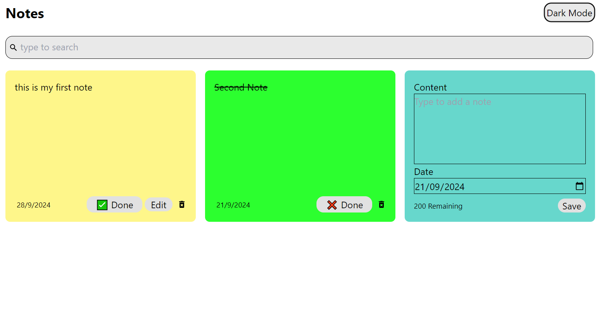
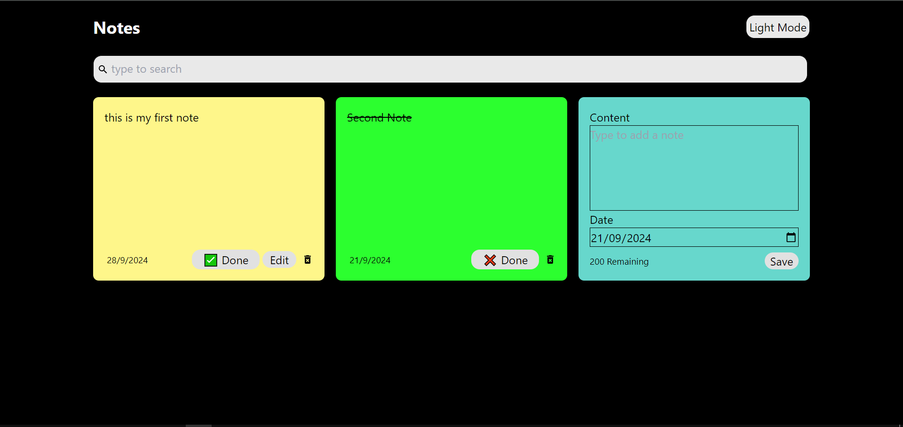

# React + Vite & Tailwind CSS

Created easy notes taking web application using React framework

Features:
1.) Context API used in this
2.) dark mode functionality added
3.) you can add notes and can be saved 'localestorage' on browser(so that whenever you refresh it won't delete your notes)
4.) you can also edit the notes, you added
5.) you can also put a mark on the note whether it is completed or not

